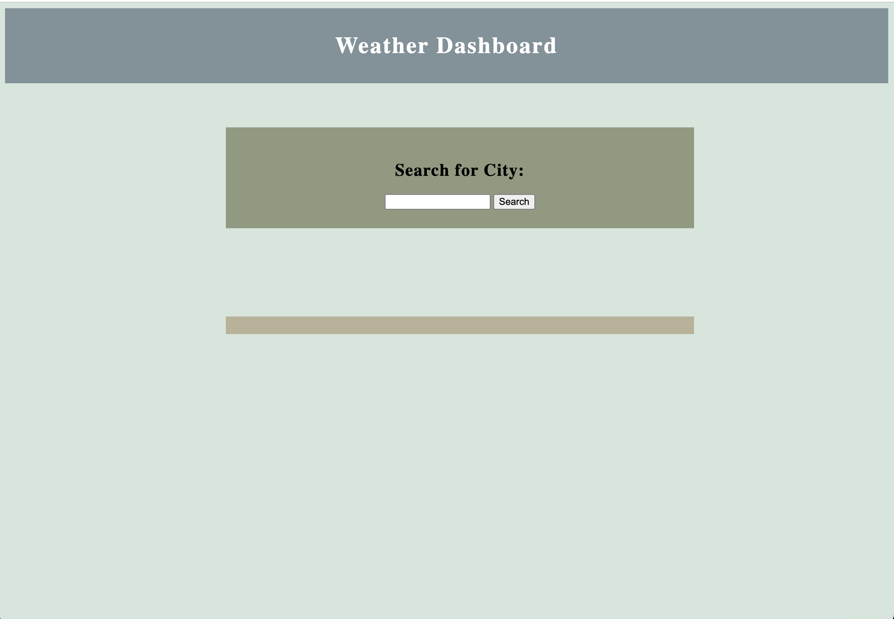
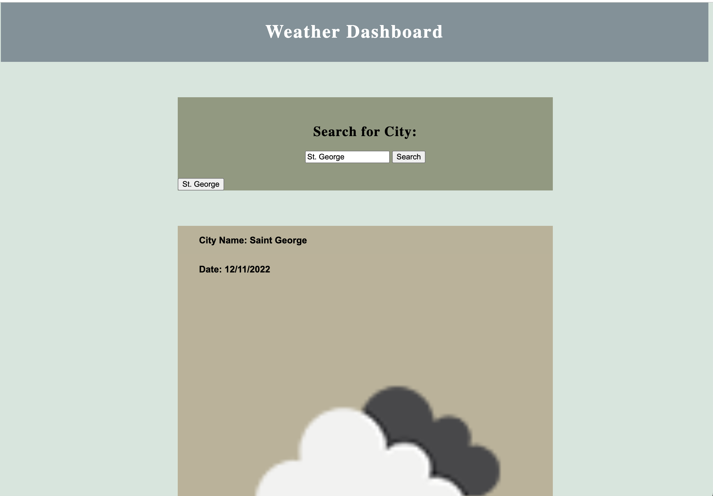

# weather-dashboard

[Weather-Dashboard](https://amandapaul1223.github.io/weather-dashboard/) is a weather dashboard that uses third-party APIs to run dynamically updated HTML and CSS. 

## Description

Weather-Dashboard allows users to search city names and retrieve the Current Weather and 5 Day Forecast for the city. Upon retrieval from the third-party APIs, the user is given the city name, date, weather icon, temperature, wind speed, and humidity index. The users city search inputs are stored in local storage and displayed for the user and then cleared with window close. 

## Website Preview

## Authors and Acknowledgement

Created by Amanda Paul 

## License

[MIT](https://choosealicense.com/licenses/mit/)
